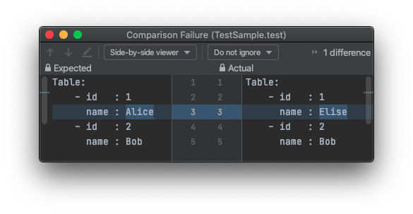

# Turntables

[](https://maven-badges.herokuapp.com/maven-central/io.github.nblxa/turntables)
[](https://circleci.com/gh/nblxa/turntables)
[](https://coveralls.io/github/nblxa/turntables?branch=master)
[](https://sonarcloud.io/dashboard?id=io.github.nblxa:turntables)

`Turntables` enables developers to write test assertions for data in tables
using a simple fluent interface.



Assertion errors are shown in an IDE-friendly way. The screenshot above
demonstrates how IntelliJ IDEA highlights the differences between the actual and
expected tables in the
[sample test](turntables-core/src/test/java/io/github/nblxa/turntables/test/assertj/TestSample.java).

```java
  @Test
  public void test() {
    Tab actual = Turntables.tab()
        .col("name").key("id")
        .row("Elise", 1)
        .row("Bob", 2);

    Turntables.assertThat(actual)
        .colMode(Settings.ColMode.MATCH_BY_NAME)
        .rowMode(Settings.RowMode.MATCH_BY_KEY)
        .matches()
        .key("id").col("name")
        .row(1, "Alice")
        .row(2, "Bob")
        .asExpected();
  }
```

## JUnit support

`Turntables` integrates with `JUnit` to help developers set up initial test data
in tables:

```java
@Rule
public TestDataSource testDataSource = TestDataFactory.jdbc(
        "jdbc:mysql://localhost:3306/mydb", "testuser", "str0ngPA55word!");

@TestTable(name = "employees", cleanUpAction = CleanUpAction.DROP)
public Tab testTab = Turntables.tab()
  .col("id").col("name")
  .row(1, "Alice")
  .row(2, "Bob");
```

Use the table name in test methods to get its contents for assertions.

```java
Tab actual = testDataSource.ingest("employees");
```

For a complete example with MySQL, see
[ITMySql.java](turntables-mysql/src/test/java/io/github/nblxa/turntables/test/mysql/ITMySql.java).

For Oracle, see:
[ITOracle.java](turntables-ojdbc/src/test/java/io/github/nblxa/turntables/test/oracle/ITOracle.java).

## Difference to AssertJ-DB

Turntables's main power and difference from
[AssertJ-DB](https://github.com/assertj/assertj-db) is the ability to match
whole table contents at once using specific rules (e.g. match rows by key or
match columns by name) and to present to the developer only the difference that
matters for the assertion.

As a result, less code must be written for tests and it's easier to find bugs.

## Maven

Turntables extends [AssertJ](https://github.com/joel-costigliola/assertj-core)
and you'll need both dependencies.

```xml
<dependency>
  <groupId>io.github.nblxa</groupId>
  <artifactId>turntables-core</artifactId>
  <version>0.2.0</version>
  <scope>test</scope>
</dependency>
<dependency>
  <groupId>io.github.nblxa</groupId>
  <artifactId>turntables-mysql</artifactId>
  <version>0.2.0</version>
  <scope>test</scope>
</dependency>
<dependency>
  <groupId>org.assertj</groupId>
  <artifactId>assertj-core</artifactId>
  <version>3.18.1</version>
  <scope>test</scope>
</dependency>
```

The above example uses a MySQL 8 dependency. If you use Turntables with another
JDBC database, see [JDBC](JDBC.md) for additional dependencies.

## Build

A quick build skipping integration tests:

```bash
./mvnw clean package
```

Integration tests use [Docker](https://docker.com).

The Oracle test is containerized using the image `quillbuilduser/oracle-18-xe`.
* Docker Hub: https://hub.docker.com/r/quillbuilduser/oracle-18-xe
* Source: https://github.com/deusaquilus/docker-oracle-xe

Image size is **13GB** at the time of writing this, so it's advisable to
download it beforehand.

Build with integration tests:

```bash
docker run --rm -itd --name oracle -p 1521:1521 quillbuilduser/oracle-18-xe
docker run --rm -itd --name mysql -e MYSQL_ROOT_PASSWORD=tiger -e MYSQL_DATABASE=testdb -p 3306:3306 mysql:8.0.22
( docker logs -f mysql & ) | grep -m1 'MY-010931'
( docker logs -f oracle & ) | grep -m1 'DATABASE IS READY TO USE!'
./mvnw clean verify || true
docker stop oracle 2>/dev/null || true
docker stop mysql 2>/dev/null || true
```
